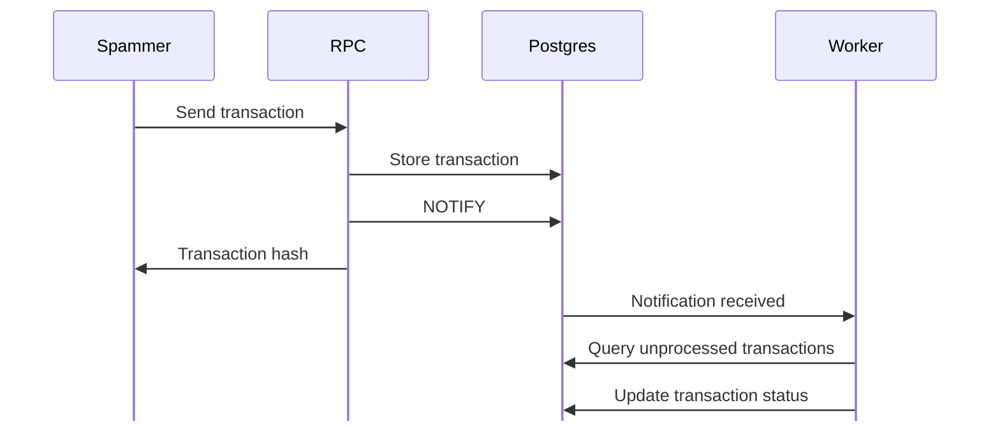

# Production Template

> Work in progress

A production-ready template for Rust services (Router with ETH-JSON RPC API and background worker), PostgreSQL for storage, observability stack (Grafana, Loki, Alloy), and infrastructure as code (IaC) for cloud provisioning (AWS terraform).

## Architecture Diagram



## Quick Start

**Build services**

Build the docker image which contains the rpc, worker and spammer.

```shell
just build
```

**Start & stop services**

Start the docker compose configuration.

```shell
just run
```

Stop and retain state.

```shell
just stop
```

Stop and delete local state.

```shell
just nuke
```

**View dashboards**

Open http://localhost:3000 in your browser of choice and log in with the default credentials `user=admin` & `password=admin`

On the left side of the screen navigate to `Dashboards` and select a dashboard.

## Crates

- **database**: Sea-ORM abstraction layer for PostgreSQL
- **database/migration**: Sea-ORM Migrator tool for managing database schema changes
- **rpc**: ETH-JSON RPC server storing incoming transaction requests
- **spammer**: Transaction spammer for the rpc to simulate workload
- **worker**: Background worker listening for database notifications and processing unprocessed transactions

## Development

- **Dockerfile**: Multi-stage build compiling the RPC, Worker and Spammer binaries into a single image
- **docker-compose.yml**: Defines all services for local use
- **grafana**: Various files for observability configuration and dashboards
- **justfile**: Contains various commands to manage the repo
